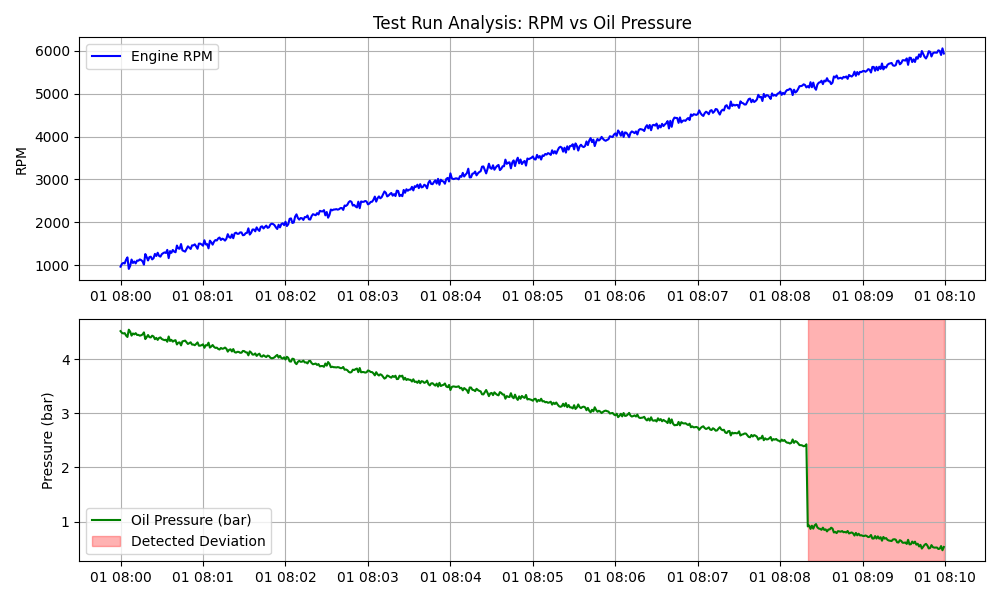

# Spec-Agent: LLM-Driven Test Bench Analyst

[](https://www.python.org/)
[](https://python.langchain.com/docs/concepts/#agents)
[](https://newsroom.porsche.com/en/innovation.html)


> **Context:** Engineering Prototype for Automating Test Bench Validation via Generative AI & Process Analytics.

## 💡 Project Overview
**Spec-Agent** is a prototype designed to demonstrate how **Large Language Model (LLM) Agents** can automate the analysis of complex test bench data ("Prüfstandsdaten").

In a traditional workflow, engineers manually inspect CSV logs to find failures. This project proposes an autonomous agent that uses **Function Calling** and **Process Analytics** logic to:
1.  Ingest raw sensor data.
2.  Detect logical process deviations (e.g., *Pressure drop during high-load phase*).
3.  Generate visual evidence and root-cause summaries automatically.

*Note: This repository contains a standalone simulation of the agent's logic to demonstrate the workflow without requiring an active OpenAI API key.*

## 📊 Automated Validation Results
The agent successfully analyzed a powertrain "Run-up Test" and detected a critical anomaly where oil pressure failed to maintain stability under high RPM.



### 🔍 Engineering Interpretation
*   **Top Graph (RPM):** The test followed a standard linear ramp-up from 1,000 to 6,000 RPM.
*   **Bottom Graph (Oil Pressure):** The system behaved normally (linear inverse relation) until **01:08:08**.
*   **Red Zone (Anomaly):** The Agent's Process Mining logic detected a sudden drop in pressure (< 1.0 bar) while RPM was > 5,000. This violates the safety protocol and was automatically flagged as a **"Process Deviation."**

## 📂 Repository Structure
```bash
Spec-Agent/
├── main.py              # Agent Logic (Simulating Function Calling & Analysis)
├── test_bench_log.csv   # Synthetic Sensor Data (Generated on runtime)
├── analysis_chart.png   # Automated Visualization Output
├── agent_report.md      # Automated Markdown Summary
└── README.md            # Project Documentation
```

## ⚙️ Technical Methodology
The prototype simulates an **Agentic Workflow** typically orchestrated by frameworks like **LangChain**:

1.  **Data Ingestion:** The agent loads time-series data using `pandas`.
2.  **Tool Usage (Simulated):**
    *   `analyze_process_stability()`: Applies conditional logic to detect when the system leaves its valid operating window.
    *   `generate_visualization()`: Uses `matplotlib` to highlight the exact timeframe of the failure.
3.  **Reporting:** Synthesizes the findings into a human-readable format.

## 💻 How to Run
To reproduce the analysis and generate the plot locally:

1.  **Clone the repository**
    ```bash
    git clone https://github.com/adititakale01/Spec-Agent.git
    cd Spec-Agent
    ```

2.  **Install dependencies**
    ```bash
    pip install pandas matplotlib numpy
    ```

3.  **Execute the Agent**
    ```bash
    python main.py
    ```
    *This will generate a new `analysis_chart.png` and `agent_report.md` based on a fresh simulation.*

## Future Roadmap
To transition this prototype into the **Innovationspool** production environment:
*   **LLM Integration:** Connect the logic to **GPT-4o** or **Llama 3** via LangChain to allow natural language querying (e.g., *"Agent, show me all runs where temperature exceeded 110°C"*).
*   **Process Mining:** Implement **pm4py** to visualize the complete control flow of the test cycle.
*   **Live Connection:** Connect the data loader directly to a Grafana / InfluxDB stream for real-time monitoring.
